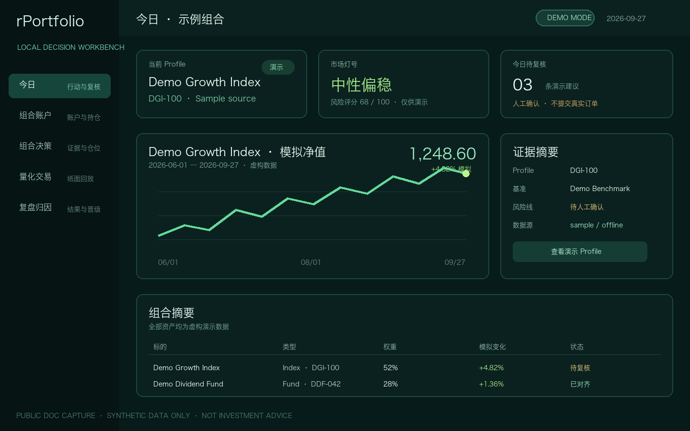

# rPortfolio

<p align="center">
  中文 · <a href="README_EN.md">English</a>
</p>

`rPortfolio` 是 r 系列的本地优先组合决策工作台：按 profile 拉取市场数据，结合真实账户、现金、持仓和成交记录，计算技术结构、风险维度、仓位计划与执行约束，并把建议、委托、成交和复盘连接成可审计闭环。

它用于风险监控、人工决策和执行参考，不承诺收益，不做自动买卖点黑盒，也不会无人值守地下真实订单。

## 产品形态

- 可见应用名：`rPortfolio`
- 二进制、软件包与 Rust crate：`rportfolio`
- 架构：`modular-workbench`
- 工作域：持仓真值、组合决策、情境研究、执行工作台与结果复盘
- 非目标：承诺收益、无人值守提交真实订单，以及不可解释的机器学习信号

## 产品工作区

- **今日**：汇总待处理建议、阻断项、延期复核和已闭环成交；支持接受、拒绝、延期、标记已复核，并展示“决策 → 委托 → 成交”的审计链。
- **组合账户**：管理账户、现金、持仓、交易和估值设置；标准 CNY/USD 对账单必须先预览、校验和去重，再写入带恢复备份的本地账本。
- **资产研究**：从组合或 Profile 标的进入单资产视图，查看实时快照、盘口/成交摘要、技术检查、边界条件和执行路线。
- **组合决策**：在“决策 / 检查”两种视角间切换，并按概览、结构、回测、规则和指标查看证据；分析标签按需加载和预取。
- **量化交易**：把信号、仓位、加减仓、退出、风险、执行和评估策略组合为可回放策略，支持纸面成交和晋级证据。
- **复盘归因**：维护日终估值、入金/出金、收益归因、建议结果和版本晋级；只有价格、账户、汇率、基准和日期对齐时才允许记录正式快照。

主流程是：

```text
Profile / 数据源 → 市场分析 → 组合计划 → 人工决策
→ 委托与成交 → 日终快照 → 结果归因与策略晋级
```

## 公开演示界面



仓库和官网截图只使用虚构的 `Demo Growth Index`、`Demo Dividend Fund`、`DGI-100` 与 `DDF-042` 数据，不包含真实账户、个人持仓、订单或收益历史。完整说明见[演示数据与界面截图](docs/demo-data.md)。

## 快速开始

```bash
npm install
npm run dev
```

## 常用命令

```bash
npm run check
npm run manifest:check
npm run repo:check
npm run build
npm test
npm run web:build
npm run rust-check
npm run rust-test
npm run size
npm run clean
npm run clean:all
```

`npm run check` 是日常源码验收入口，会检查 App Manifest、公开仓库边界、Rust 格式、前端测试与构建以及 Rust 测试和编译。`npm run dev` 启动 Tauri 桌面应用。`npm run build` 只用于本地开发验证，不作为正式 Release 资产来源。`npm test` 运行确定性的前端领域测试，覆盖组合会计、决策队列、纸面执行、A 股成交、基金结算、估值、回测、响应式布局和延迟模块加载。

## 发布流程

rPortfolio 不从开发 Mac 上传安装包。批准的周末发布窗口内，由发布服务器生成过滤后的干净源码记录并推送与版本一致的 `vX.Y.Z` Tag；GitHub Actions 从该 Tag 构建 macOS / Windows 候选包并创建 Draft prerelease。维护者完成签名状态、校验和、安装行为、更新日志与官网元数据复核后，才决定是否公开。

当前 `0.1.x` 构建仍未完成 macOS Developer ID 签名与公证、Windows Authenticode 签名和 updater 闭环，因此不会作为官网正式下载。详见[发布流程](docs/RELEASE_WORKFLOW.md)，版本变化见[更新日志](CHANGELOG.md)。

## CLI

开发时通过 Cargo 构建或运行：

```bash
cargo run --quiet --manifest-path ./src-tauri/Cargo.toml -- info --json
cargo run --quiet --manifest-path ./src-tauri/Cargo.toml -- capabilities --json
cargo run --quiet --manifest-path ./src-tauri/Cargo.toml -- profiles --json
cargo run --quiet --manifest-path ./src-tauri/Cargo.toml -- sources --json
cargo run --quiet --manifest-path ./src-tauri/Cargo.toml -- score --profile us-core --source auto --json
cargo run --quiet --manifest-path ./src-tauri/Cargo.toml -- score --profile a-share-risk --source china --json
cargo run --quiet --manifest-path ./src-tauri/Cargo.toml -- score --profile ai-semiconductor --source sample --json
cargo run --quiet --manifest-path ./src-tauri/Cargo.toml -- score --profile korea-ai-risk --source auto --json
cargo run --quiet --manifest-path ./src-tauri/Cargo.toml -- score --profile ./my-profile.json --source csv --json
cargo run --quiet --manifest-path ./src-tauri/Cargo.toml -- score --profile ./my-profile.json --source sample --as-of 2026-04-17 --json
```

支持的数据源：

- `auto`：优先使用 Profile 已配置的 CSV；A 股 Profile 随后尝试中国市场多数据源路径，再依次降级到 Stooq/Yahoo 和示例数据
- `china`：使用东方财富前复权 A 股/ETF 日线，失败时降级到新浪；境外标的使用 Yahoo，并对同一交易日的核心基准执行交叉检查
- `stooq`：公开的 Stooq 日线历史数据
- `hybrid`：Yahoo 股票和 ETF 数据叠加 FRED 宏观数据
- `yahoo`：严格使用 Yahoo Finance chart 接口
- `csv`：从 `profile.dataDir` 或各标的的 `csvPath` 读取本地日线 OHLCV 文件
- `sample`：确定性的离线演示数据

JSON 输出始终遵循以下信封：

```json
{
  "ok": true,
  "command": "score",
  "data": {
    "score": 68
  }
}
```

错误返回：

```json
{
  "ok": false,
  "error": {
    "code": "invalid_arguments",
    "message": "asOf must use YYYY-MM-DD"
  }
}
```

## 评分模型与 Profile

应用使用 `src-tauri/profiles/` 下透明、可审查的 JSON Profile。每个 Profile 定义：

- 标的及对应的 Yahoo ticker
- 本地、免费或供应商导出数据的可选 CSV 路径
- 基准
- 动态技术表格列
- 风险维度、权重和规则

内置 Profile：

- `us-core`：SPY / QQQ / SMH / NVDA / IWM / VIX
- `global-risk`：股票、波动率、美元、利率、信用与避险资产
- `ai-semiconductor`：AI 硬件与半导体产业链
- `korea-ai-risk`：KOSPI/EWY、韩国 AI 龙头、韩元和美国半导体确认信号
- `a-share-risk`：A 股指数模板
- `hk-tech`：香港科技股模板

桌面端自定义 Profile 可放在 `~/.rportfolio/profiles/*.json`，也可以通过 `RPORTFOLIO_PROFILE_DIR` 指向其他目录。为迁移旧数据，应用仍会读取 `~/.rmarket/profiles` 和 `RMARKET_PROFILE_DIR`。有效的自定义 Profile 会加入桌面端 Profile 菜单，并可使用相对 CSV 路径。

个人账户、持仓、交易、订单、业绩历史和已应用的对账单批次元数据，会以版本化 JSON 存储在 Tauri 应用数据目录中。Web 预览模式下，同一组领域数据会降级保存到带命名空间的 `localStorage`。

组合估值当前支持 CNY 和 USD。权重、现金限制与风险预算使用用户选择的基础币种，订单票据保留标的结算币种。跨币种估值需要带日期的 USD/CNY 汇率；估值输入缺失或过期时，应用会阻断增加风险的动作。

组合账户工作区接受一份标准 CNY/USD 对账单 CSV，覆盖账户余额、持仓、交易和外部现金流。每个批次都必须先预览并校验；重复内容由校验和阻断，桌面端写入前会创建恢复备份。记录真实日终业绩快照时，还要求收盘日期与价格、账户真值、必要汇率和基准数据对齐。

每份报告包含触发规则、行动图价格线、分阶段机会评分、支持证据、状态验证回测统计、按 Profile 生效的龙头确认规则、头肩形态和双顶/双底检查，以及风险管理建议，确保评分可审计。建议记录会保留 Profile/Schema 版本、信心、失效条件、复核日期、处置结果、关联订单/成交 ID 和后续结果。

量化交易工作区使用可组合的策略 policy，覆盖信号、仓位、加减仓、退出、风险、执行和评估。

中文架构文档索引：

- [产品架构](docs/product-architecture.md)：产品目标、领域边界、金融不变量与模块迁移顺序
- [策略架构](docs/strategy-architecture.md)：策略扩展合同、组合方式、晋级门槛与回放约束
- [量化交易架构](docs/quant-trading-architecture.md)：StrategyEngine、订单生命周期、Broker Adapter、风控闸门与后续落地顺序

## 数据说明

A 股数据路径优先使用东方财富前复权日线；东方财富不可用时降级为新浪不复权日线，并在最近一个共同交易日使用独立数据源交叉检查核心基准。差异超过 2% 会标记为一致性失败并阻断增加风险的建议。成功获取的中国市场快照最多缓存七个自然日，且只作为明确标注的降级回退使用。

`csv` 模式仍是连接 AkShare、TuShare、交易所下载或持牌供应商的推荐桥梁：导出包含 `date/open/high/low/close/volume` 列的日线文件，可选增加 `foreign_flow` 等资金流字段，再让 Profile 指向这些文件。

如需生产级长期使用，应在同一 Rust 数据边界后接入正式数据供应商，例如 Alpha Vantage、Polygon、Twelve Data 或持牌香港市场数据源。

MVP 不使用 SQLite。个人金融领域数据采用支持备份和恢复的版本化本地 JSON 存储；正式接入供应商后，API key 和付费数据源密钥仍应保存在应用包之外。

## 项目结构

```text
src/
  App.tsx
  components/
    analysis-tabs/
  hooks/
  lib/
  styles/
  theme/
src-tauri/
  src/
    cli.rs
    core.rs
    lib.rs
    main.rs
```

公开仓库边界、贡献约定与安全报告方式见 [PUBLIC_REPOSITORY.md](PUBLIC_REPOSITORY.md)、[CONTRIBUTING.md](CONTRIBUTING.md) 和 [SECURITY.md](SECURITY.md)。
