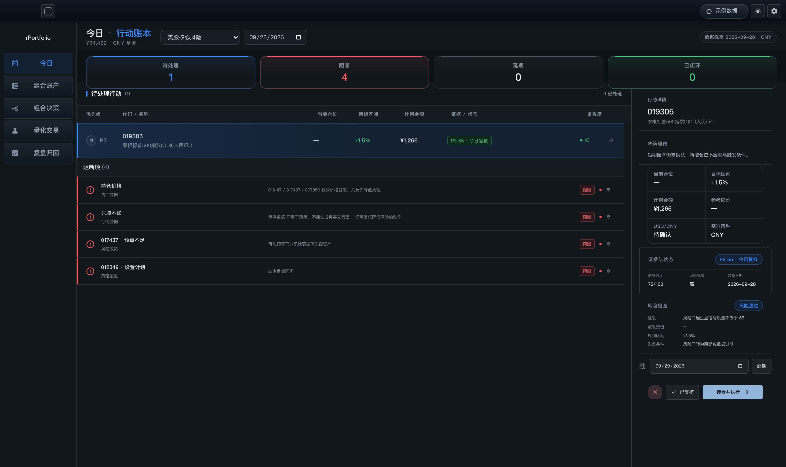
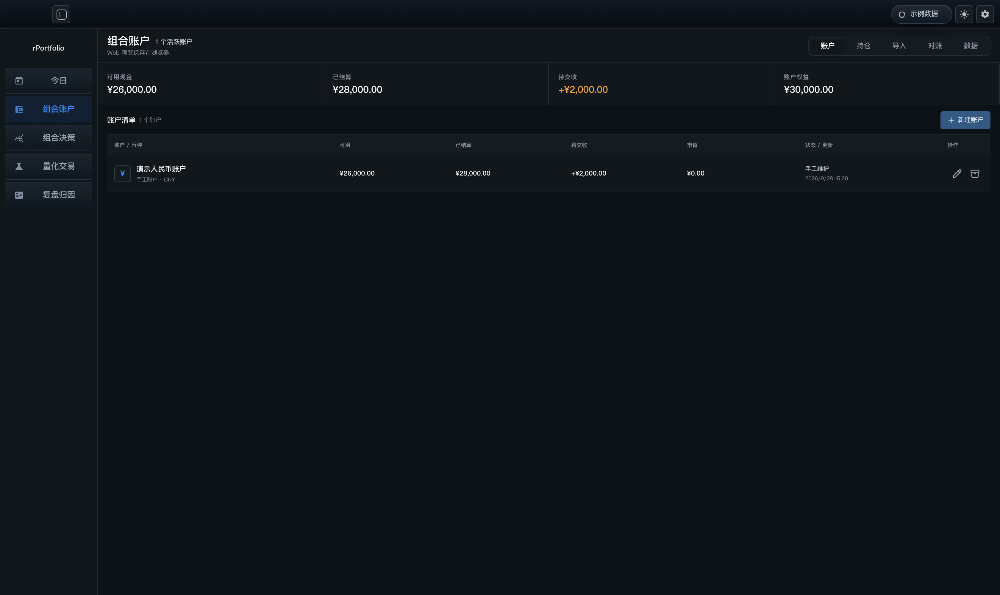
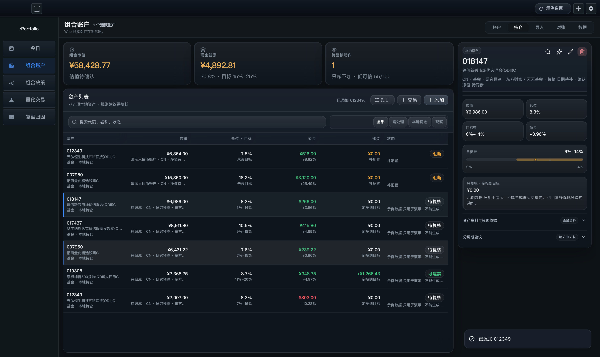
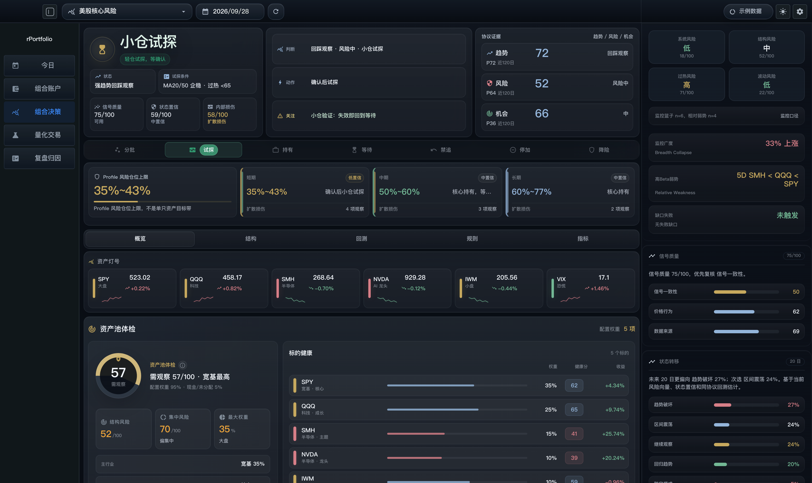
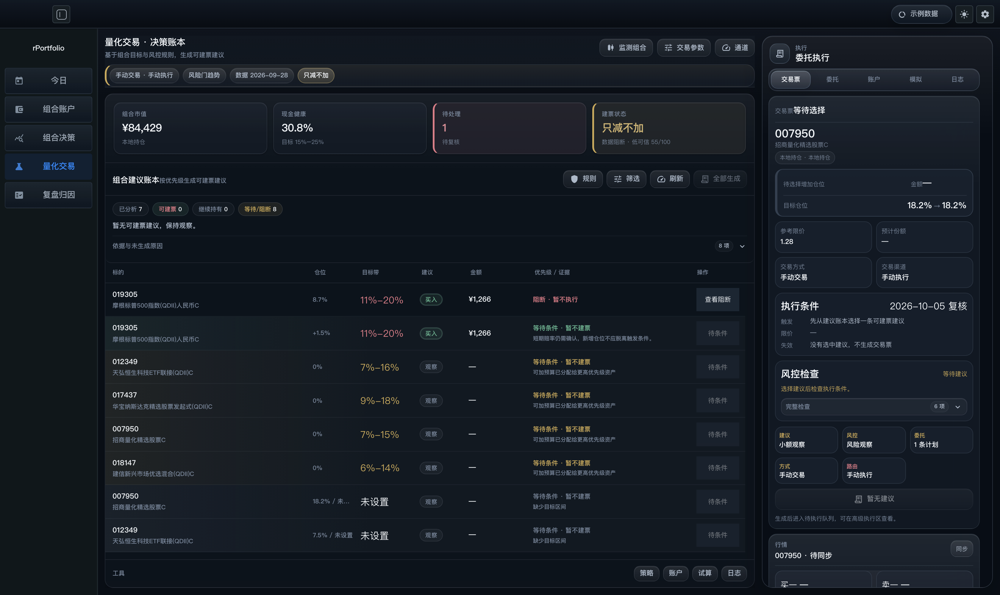
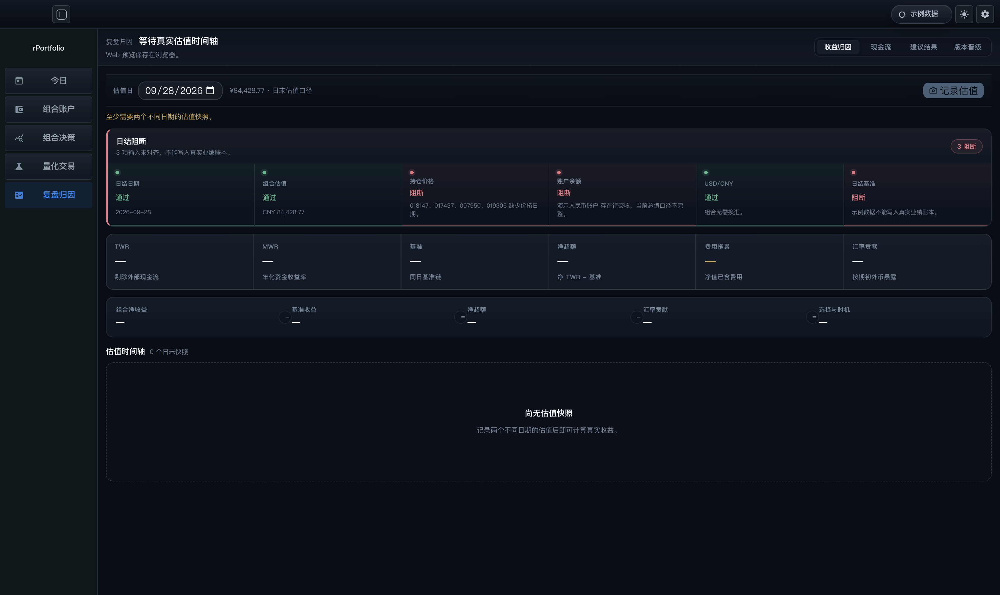

# 工作区导览

rPortfolio 的主界面由五个菜单工作区组成，外加一个从持仓或决策进入的资产研究视图。本文档逐一说明每个工作区的用途、关键区域和数据流。所有截图均来自应用内置的示例数据模式，不包含真实账户信息；数据边界见[公开演示数据与界面截图](demo-data.md)。

主流程贯穿五个工作区：

```text
Profile / 数据源 → 市场分析 → 组合计划 → 人工决策
→ 委托与成交 → 日终快照 → 结果归因与策略晋级
```

---

## 1. 今日 — 行动、阻断与复核



「今日」是每天打开应用的起点，把当前 Profile 的建议收敛成一份可执行的行动账本。

| 区域 | 说明 |
| --- | --- |
| 概况指标 | 待处理、阻断、延期、已闭环四个计数瓦片，按状态着色（处理中为强调色、阻断为红色、已闭环为绿色）。 |
| 待处理行动 | 按优先级排序的建议队列，展示当前仓位、目标区间、计划金额、证据状态和紧急度。 |
| 阻断项 | 缺价格日期、只减不加等阻断原因列表；阻断时只允许降低风险的动作。 |
| 行动详情 | 右侧检查器展示决策理由、仓位对照、证据与状态、风险检查明细，并提供拒绝、已复核、延期、接受并执行四个动作。 |

顶部命令栏可切换 Profile 和估值日期；延期动作需要选择复核日期，形成「决策 → 委托 → 成交」的审计链入口。

## 2. 组合账户 — 账户、现金、持仓与对账

组合账户工作区分五个标签：账户、持仓、导入、对账、数据。

### 账户标签



维护人民币 / 美元现金口径：可用现金、已结算、待交收和账户权益四个指标，加上账户清单。现金是仓位规划和下单预算的事实来源；标准对账单需要先预览、校验和去重，再写入带恢复备份的本地账本（见「导入」与「数据」标签）。

### 持仓标签



本地资产台账：资产列表支持搜索与范围筛选（全部 / 需处理 / 本地持仓 / 观察），每行展示市值、仓位 / 目标带、盈亏、建议和状态。选中资产后右侧检查器展示市值、仓位、目标带滑块、盈亏、阻断原因和资产资料来源。顶部「组合市值 / 现金健康 / 待复核动作」三张摘要卡按健康度着色。支持添加本地持仓、记录交易和维护仓位规则。

## 3. 组合决策 — 状态、证据与仓位



组合决策是 Profile 分析的主展示页面，在「决策 / 检查」两种视角间切换，并按五个标签查看证据：

- **概览**：状态判断、动作建议、趋势 / 风险 / 机会评分和资产灯号。
- **结构**：资产池体检、集中风险与行业分布。
- **回测**：策略历史表现证据。
- **规则**：触发中的规则与失效条件。
- **指标**：信号质量、状态量信与内部损伤明细。

右侧风险栏展示系统 / 结构 / 过热 / 波动四个风险维度、监控广度与状态转移估计。分析标签按需加载和预取，避免一次性拉取全部证据。

## 4. 量化交易 — 监测、下单、执行



量化交易把组合建议转化为可回放的执行账本。

| 区域 | 说明 |
| --- | --- |
| 环境摘要 | 组合市值、现金健康、待处理和建议状态四张指标卡，按健康度着色。 |
| 组合建议账本 | 按优先级生成可建票建议，展示仓位、目标带、建议方向、金额与证据；不可执行建议展示原因并提供「查看阻断」。 |
| 委托执行栏 | 右侧执行面板：交易票、委托、账户、模拟、日志五个标签；生成卖出入票前会展示参考限价、预计份额、执行条件与风控检查。 |
| 工具入口 | 底部工具条进入策略、账户、试算和日志面板。 |

支持纸面成交（模拟）和晋级证据；风险门趋势异常时进入「只减不加」等保护模式。

## 5. 复盘归因 — 收益、结果与晋级



复盘归因维护日终估值与业绩账本，分四个标签：收益归因、现金流、建议结果、版本晋级。

- **日结准备度**：日结日期、组合估值、持仓价格、账户余额、USD/CNY 和日结基准六项检查，逐项显示通过 / 确认 / 阻断；全部对齐才允许记录正式快照。
- **收益指标**：TWR（剔除外部现金流）、MWR（年化资金收益率）、基准、净超额、费用拖累和汇率贡献。
- **归因拆解**：组合净收益 − 基准收益 = 净超额 − 汇率贡献 = 选择与时机。
- **估值时间轴**：正式估值快照列表；至少需要两个不同日期的快照才能计算真实收益。
- **现金流标签**：入金 / 出金记录；**建议结果标签**：建议 → 委托 → 成交 → 结果的闭环复盘；**版本晋级标签**：策略版本的晋级队列。

---

## 界面风格

五个工作区共享一套高级、克制的设计语言：

- 页头识别：每个工作区顶部使用「页面名 · 副标题」的标题锁定，副标题使用强调色；命令栏带轻微的纵向渐变底色。
- 状态着色的指标瓦片：大号等宽数字（tabular-nums）按健康度（正常 / 强调 / 警告 / 危险）着色，瓦片顶部有状态色渐变线，底色为对应状态的柔和渐变，hover 时轻微上浮并加深阴影。
- 分层卡片与悬浮态：卡片使用半透明玻璃面板、细边框、浅阴影与内侧高光，hover 时上浮并染上状态色的光晕。
- 专业表格排版：表头使用小号加宽字距的弱化文字，行 hover 时出现左侧强调线与高亮背景；金额与百分比一律使用等宽数字对齐。
- 语义化空状态：空列表使用虚线边框与居中说明，明确下一步动作。
- 一致的阻断语义：红色 = 阻断、琥珀 = 需确认、绿色 = 通过，贯穿今日、量化与复盘；日结检查项带状态圆点与渐变底色。
- 主题适配：浅色与深色主题共用同一套结构，高光与阴影通过主题 token 适配；每个工作区均提供浅色 / 暗色两套截图。

## 相关文档

- [产品架构](product-architecture.md)
- [量化交易架构](quant-trading-architecture.md)
- [策略架构](strategy-architecture.md)
- [公开演示数据与界面截图](demo-data.md)
